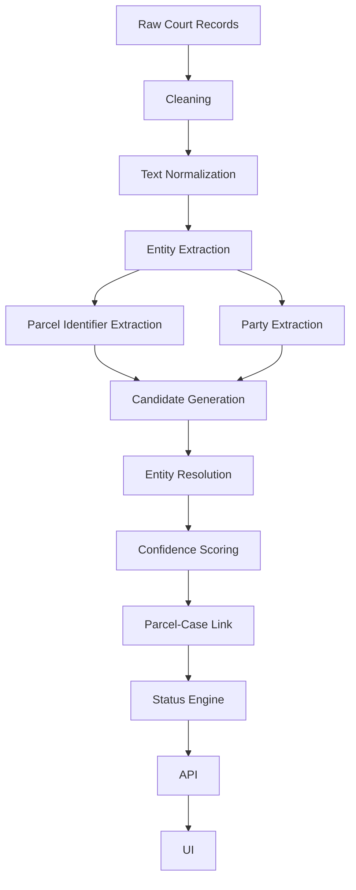
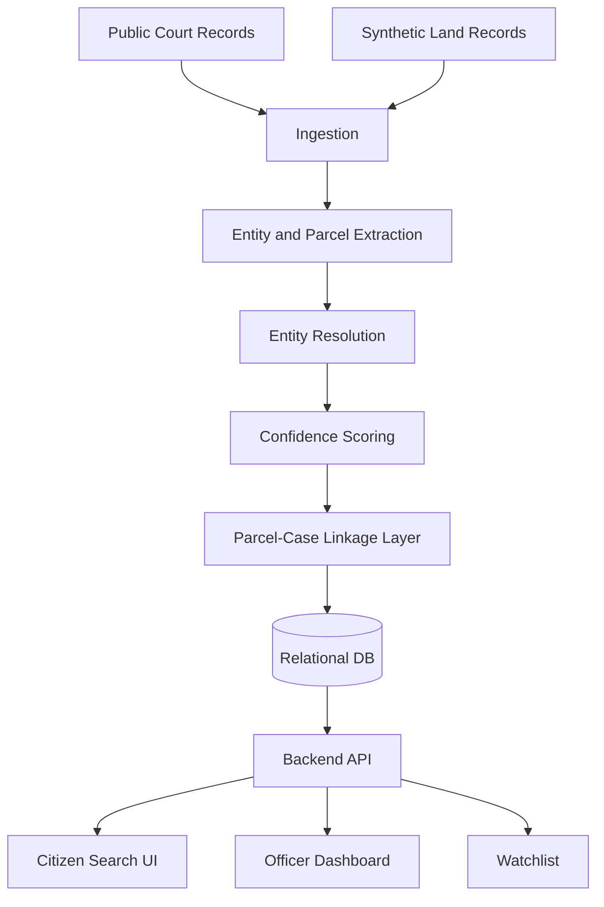

# Vivaad Radar — Product Requirements Document

**Alt name:** Case-on-Land
**Version:** 1.0 (Hackathon Build Spec)
**Status:** Draft — ready for implementation
**Hackathon scope:** MVP buildable in under one day
**Primary audience:** hackathon team + any implementing AI coding agent
**Central question everything in this document serves:** *"Is this land in court?"*

---

## Part 1 — Executive Summary & Problem

### 1. Executive Summary
- **Project:** Vivaad Radar
- **Tagline:** Land records tell you who is recorded against the land. Vivaad Radar tells you who is fighting over it.
- **One-line:** A court↔parcel linkage layer that tells a buyer, officer, or lawyer whether a piece of land is entangled in active litigation — evidence-backed, confidence-scored, not a guess.
- **Problem:** Land records and court records are separate, differently-keyed systems. Pending litigation on a parcel is routinely invisible to a buyer even when every land-side document looks clean.
- **Solution:** Extract parcel identifiers and party names from court case data, resolve them against parcel/land records, score confidence, and surface a GREEN / AMBER / RED litigation-risk answer with evidence and a timeline.
- **Core insight:** This is not a missing-data problem. It is a missing-*linkage* problem.
- **Target users:** property buyer and district/revenue officer (primary); lawyer and bank/lender (secondary).
- **MVP:** one district/taluk; citizen search + evidence-backed result; officer heatmap + drill-down; watchlist (mocked notifications).
- **Why now:** India's land-record digitisation (DILRMP, ULPIN/Bhu-Aadhar) and court digitisation (eCourts/NJDG) both exist, run by different departments, keyed differently, and were never designed to cross-reference each other. DILRMP's own long-term ambition is a system where revenue records, registration, court records, and the ULPIN parcel ID are linked — that link does not exist as usable infrastructure today. Vivaad Radar demonstrates the missing piece.
- **Why different:** not a land portal, not a blockchain registry, not an OCR tool, not a legal chatbot — a targeted linkage-and-confidence system.

### 2. Problem Definition
- A parcel in India effectively has five separate "truths," each owned, updated, and proven differently: registered deeds, textual revenue records (RoR — called 7/12 in Maharashtra, Khatauni in UP, RTC in Karnataka, Pahani in AP, Patta in Tamil Nadu), cadastral maps (Bhu Naksha), court proceedings, and physical possession.
- Independent digitisation of each system (state Bhulekh/Bhoomi/Dharani-style portals, eCourts/NJDG) did not create cross-system linkage — each digitised its own silo for its own department.
- Court records are organised around case number, parties, court, and orders (party-centric). Land records are organised around survey/khasra/khata number and village (parcel-centric). No shared key connects them by default.
- Consequence: a pending suit that references a parcel by village and an old or sub-divided survey number (e.g. "45/1" after a partition) may never surface when someone looks that parcel up by its current land-record identifier.
- Why it matters:
  - **Buyers:** real financial risk, no warning mechanism.
  - **Officers:** no aggregate visibility into where litigation concentrates — can't spot patterns or prioritise intervention.
  - **Lawyers:** manual, court-by-court, party-by-party search with no parcel-first entry point.
  - **Technically interesting:** entity resolution across noisy, multilingual, inconsistently-formatted identifiers, with no existing ground-truth linkage table anywhere to start from.

### 3. Problem Statement
- **Non-technical:** When someone buys land, nothing today tells them a court case involving that same land is already underway.
- **Technical:** Given a parcel corpus *P* (keyed by survey/khasra/khata + village) and a court-case corpus *C* (keyed by case number, containing unstructured party/location text), construct a probabilistic record-linkage layer *L: C × P → {confidence, evidence}* that identifies parcel-referencing court cases despite identifier mismatch, transliteration variance, and incomplete text.
- **Hackathon version (for judges):** "Land records say who owns the land. Court records say who's fighting over it. Nobody connects the two — so buyers, banks, and lawyers can miss pending litigation on a property. We built the layer that connects them, with evidence and confidence, not guesses."

---

## Part 2 — Core Insight & Competitive Landscape

### 4. Core Insight
```
Court world (party-centric)          Land world (parcel-centric)
  case_no, parties, court      <-?->    survey_no, khasra, village
         orders, dates                     owner, area, map
```
- The "?" is the missing layer — no canonical ID maps a case to a parcel today (ULPIN is designed to eventually be that ID, but court records don't reference it).
- Hard because: court text is unstructured/noisy, survey numbers get cited inconsistently (subdivision produces sub-numbers like "45/1", "45/2"; old vs. new numbering after resurveys), party names vary by transliteration/spelling/patronymic form, and no dataset anywhere currently labels "this case = this parcel."

### 5. Why Existing Systems Do Not Solve It
| System | What it gives | What it lacks |
|---|---|---|
| State land-record portals (Bhulekh / Bhoomi / Mahabhulekh / Dharani-style RoR portals) | Owner, area, mutation history, Bhu Naksha map | No court/litigation visibility |
| eCourts / NJDG case-status search | Case number, parties, status, orders, near-real-time updates | Built for one-case-at-a-time human lookup by party/CNR, not by parcel; no bulk government API |
| Encumbrance Certificate (EC) | Registered transactions | Doesn't capture unregistered disputes or pending suits |
| Cadastral/parcel maps (Bhu Naksha) | Geometry, survey number | No case awareness |
| Mutation records | Ownership transfer history | No litigation awareness |
- Root cause is architectural, not a data-quality bug: each system was digitised to serve its own department, not cross-referenced by design. DILRMP's stated long-term goal is exactly this kind of integration (revenue + registration + court + ULPIN) — it does not exist as usable infrastructure yet, which is the opportunity.

### 6. Negative-Space Analysis — What We Are Deliberately NOT Building
| Rejected direction | Why rejected |
|---|---|
| Blockchain land registry | Doesn't solve linkage; solves ledger trust, and India's core issue here isn't ledger tampering |
| OCR + AI land digitisation | Crowded space; a data-entry problem, not a cross-system linkage problem |
| Generic grievance portal | A workflow/ticketing problem, not a discovery/intelligence problem |
| Generic buyer-side property due-diligence platform | Commercially occupied (title-search firms, EC aggregators); doesn't solve the underlying linkage gap either |
| Another land-record portal | We complement existing portals — we do not replace them |

**What remains under-served:** court↔parcel linkage, parcel litigation graph, confidence-scored linkage, litigation watchlist, spatial litigation intelligence.

### 7. Competitive Positioning
| Capability | Land Portal | EC | eCourts | Typical Property Due-Diligence Service | Vivaad Radar |
|---|---|---|---|---|---|
| Owner record | Yes | Partial | No | Aggregates others | No (not our job) |
| Registration data | Partial | Yes | No | Aggregates others | No |
| Court case search | No | No | Yes, by party/CNR | Manual, human-driven | Yes, by parcel |
| Parcel↔court linkage | No | No | No | Manual, ad hoc | **Yes — core product** |
| Confidence scoring | N/A | N/A | N/A | Informal human judgment | Yes, explicit |
| Litigation timeline | No | No | Per-case only | Sometimes, manual | Yes, parcel-centric |
| Spatial litigation view | No | No | No | No | Yes |
| Watchlist | No | No | Case-level, for advocates | No | Yes, parcel-level |

---

## Part 3 — Users, Goals, Non-Goals

### 8. Target Users
**Primary**
- **Property buyer** — goal: confirm the parcel isn't under litigation before paying. Pain: no way to check without hiring someone to manually search courts. Current workflow: trusts seller documents + EC + revenue record only. Vivaad Radar adds a court-side check in one search. Value: avoids buying into a dispute.
- **District/revenue officer** — goal: see where disputes cluster. Pain: litigation data isn't geographically visible today. Current workflow: case-by-case, no aggregate view. Vivaad Radar adds a heatmap + hotspot drill-down. Value: pattern detection, targeted intervention.

**Secondary**
- **Lawyer** — goal: parcel-centred case discovery instead of party-centred. Value: discover cases via land identifiers instead of already knowing party names.
- **Bank/lender** — future litigation-risk screening before disbursing a loan against land collateral.
- **Government/administration** — future land-intelligence infrastructure layer.

### 9. Personas
| | First-time land buyer | District revenue officer | Property lawyer |
|---|---|---|---|
| Context | Buying agricultural/residential plot, first purchase | Manages a taluk's land records and disputes | Handles property litigation for clients |
| Problem | Can't verify litigation status independently | No aggregate litigation visibility | Case discovery is party-name-first, slow |
| Motivation | Avoid a financial disaster | Identify dispute hotspots, respond proactively | Faster case discovery |
| Current behavior | Searches land portal, trusts seller's documents | Reviews reports manually, reactive | Searches eCourts repeatedly by party name |
| Success looks like | A clear GREEN/AMBER/RED before paying | A hotspot map with drill-down evidence | Finding a case by survey number in seconds |

### 10. Jobs To Be Done
- "Before I buy this parcel, I want to know whether publicly available court records indicate it's involved in litigation."
- "As an officer, I want to see where land disputes concentrate so I can investigate patterns."
- "As a lawyer, I want to find cases tied to a specific parcel without already knowing the party names."

### 11. Product Goals
- **User goals:** fast, trustworthy, evidence-backed litigation check.
- **Product goals:** prove the linkage concept end-to-end, on real or realistic data, for one district.
- **Technical goals:** a working extraction → resolution → confidence pipeline that is explainable at every step.
- **Hackathon goals:** a reliable 3-minute demo built around one unmistakable "wow" case.

### 12. Non-Goals
The MVP is explicitly **not**: a legal title opinion; a guarantee of clear title; a court-outcome predictor; a lawyer replacement; a full land-record management system; a grievance-redressal platform; a blockchain registry; an OCR platform; a general AI chatbot; a national court integration; a production government system.
- Why: each is either commercially saturated, out of one-day scope, or would dilute the core linkage insight judges need to remember.

---

## Part 4 — MVP & Prioritization

### 13. MVP Definition
- **Scope:** one district/taluk.
- **Data:** real public court data where practically obtainable for the chosen district (via eCourts/NJDG manual case-status lookups, or a bounded pull if a vendor API is used — see §20); synthetic-but-realistic parcel/land-record structure (survey numbers, khasra, villages, synthetic owners).
- **Pipeline:** extraction → entity resolution → confidence-scored linkage.
- **Surfaces:** citizen search + result, officer heatmap + drill-down, watchlist (mocked notifications).
- **Map:** parcel geometry (synthetic GeoJSON), colour-coded by status.

### 14. Feature Prioritization
| Feature | Priority | Purpose | User | Demo value |
|---|---|---|---|---|
| Parcel search by survey no. + village | P0 | Entry point | Citizen | Essential |
| GREEN/AMBER/RED result with evidence | P0 | Core answer | Citizen | Essential — the wow moment |
| Case detail view | P0 | Trust/verifiability | Citizen, lawyer | High |
| Litigation timeline | P0 | Makes lis-pendens visible instantly | Citizen | Very high — the "aha" |
| Officer heatmap | P0 | Spatial intelligence | Officer | High |
| Parcel drill-down from map | P1 | Officer investigation | Officer | Medium |
| Watchlist (mocked) | P1 | Future-value signal | Citizen | Medium |
| Confidence/methodology panel | P1 | Defensibility vs. hostile judges | All | High (for Q&A) |
| Case-type classification | P2 | Richer evidence | Citizen | Low-medium |
| Multi-parcel/multi-case edge-case UI | P2 | Robustness | All | Low |
| Real-time eCourts scraping live at demo | P3/Future | — | — | Risk, not value — precompute instead |
| Auth/accounts | Future | — | — | Out of scope |

---

## Part 5 — User Flows & UX

### 15. End-to-End User Flows

**Citizen flow**
```
Open app -> Enter survey number + village -> Find parcel ->
Check litigation (processing) -> Status (GREEN/AMBER/RED) ->
Case details -> Evidence -> Timeline -> (optional) Watch parcel
```
- The processing state must show conceptual steps (finding parcel → extracting references → resolving entities → checking cases → scoring match) so the pipeline feels legible, not magical.

**Officer flow**
```
Open dashboard -> Select district/village -> View litigation map ->
Identify hotspot -> Click parcel -> Inspect cases -> Inspect evidence ->
Identify cluster/pattern
```

**Lawyer flow:** secondary/future — same search entry point as citizen, result adds case-filing shortcuts (not part of MVP UI polish).

### 16. UX/UI Requirements (screens)
| # | Screen | Key content |
|---|---|---|
| 1 | Landing/search | Headline "Is this land in court?"; survey no. + village input |
| 2 | Processing state | Step list: finding parcel → extracting refs → resolving entities → checking cases → scoring |
| 3 | GREEN result | "No matching active litigation found in available records" + disclaimer |
| 4 | AMBER result | "Possible connection — verification recommended" + partial evidence |
| 5 | RED result (strongest screen) | Case no., court, status, confidence %, matched evidence fields, CTA to case detail/timeline |
| 6 | Case detail | Parties, roles, case type, court, filing date, status, next hearing, matched fields |
| 7 | Litigation timeline | Filing → interim order → land transaction (if any) → present, one horizontal axis |
| 8 | Officer dashboard | District/village selector, summary counts, heatmap |
| 9 | Map | Parcel polygons coloured by status, click → drill-down |
| 10 | Watchlist | List of watched parcels, mocked "new update" state |
| 11 | Methodology/evidence panel | Plain-language explanation of how confidence was computed |
- Empty/error states: no parcel found → suggest checking spelling/format; API/data unavailable → fall back to cached/demo mode silently (never show a raw error to a judge).
- Mobile: search + result screens must be usable at phone width; officer map can be desktop-first.

---

## Part 6 — Status Model & Data Model

### 17. Status/Risk Model
| Status | Meaning | Requirement |
|---|---|---|
| GREEN | No matching active litigation found in the available dataset | No candidate link scores at or above the LOW confidence threshold |
| AMBER | Possible litigation connection; verification recommended | Best candidate in the MEDIUM band, or an exact identifier match with weak party-name match |
| RED | High-confidence litigation connection found | Best candidate in the HIGH band **and** a survey-number match (exact or normalized) |
- Critical disclaimer built into the UI copy itself: **GREEN ≠ "legally safe."** It means "nothing found in available records." **RED ≠ a legal adjudication.** It means "strong evidence of a linkage," not a court ruling on title.
- Precision-first rule: RED must never fire on party-name similarity alone without an identifier match — a false RED is more damaging than a missed weak match.
- Incomplete data → status must degrade to AMBER with an explicit "data incomplete" flag, never silently GREEN.

### 18. Core Technical Concept
```
Person --owns--> Parcel
Person --party_to--> Case
Case --mentions--> Parcel
Parcel --linked_to--> Case   (derived, confidence-scored)
```
- This is a lightweight knowledge graph / linkage layer, implemented as relational tables plus a link table — not a graph database (see §38).

### 19. Data Model
| Entity | Key fields |
|---|---|
| **Parcel** | id, survey_no, khasra_no, khata_no, village, taluk, district, area, geometry (GeoJSON), owner_ref (synthetic) |
| **Person** | id, name, name_normalized, father_name, address (synthetic on the land side) |
| **CourtCase** | id, case_no, court, case_type, filing_date, status (active/closed/disposed/unknown), next_hearing_date, raw_text_ref |
| **CaseParty** | case_id, person_id, role (plaintiff/defendant/respondent/etc.), name_as_written |
| **CourtEvent** | id, case_id, event_type (filed/hearing/interim_order/judgment), date, note |
| **ParcelCaseLink** | id, parcel_id, case_id, confidence_score, confidence_band, evidence (JSON: matched fields), status (RED/AMBER/GREEN), created_at |
| **Watchlist** | id, user_ref, parcel_id, subscribed_at, last_notified_at (mocked) |
| **SourceRecord** | id, source_type (real/synthetic/mocked/derived), origin, ingested_at, raw_ref |
- Every `SourceRecord` provenance field is mandatory — judges must be able to trace any datum back to real vs. synthetic.

---

## Part 7 — Data Sourcing & Pipeline

### 20. Data Sources
- **Court data:** the official eCourts Services portal and NJDG are public but built for one-case-at-a-time human lookup (by CNR — the 16-character canonical Case Number Record — or party name), not bulk/automated access; there is no free government bulk API. Options: (a) manually pull a small, bounded, real sample for the chosen district's cases, or (b) use a third-party vendor API that mirrors eCourts/NJDG data if budget/time allow. Either way — a small, bounded, real sample, not a national ingestion attempt.
- **Land data (hackathon):** synthetic parcels with realistic structure — real-looking survey/khasra/khata numbering conventions (including sub-division numbers like "45/1", "45/2" that arise from partition, matching how real cadastral systems work) and real village names for the chosen district, with synthetic owners. Synthetic ownership is appropriate because real ownership data isn't freely available and isn't the point being demonstrated — the *linkage mechanism* is. Note: India's DILRMP programme is rolling out ULPIN (Bhu-Aadhar), a 14-digit national parcel ID, with the explicit long-term goal of linking revenue, registration, and court records — Vivaad Radar's premise is aligned with, and ahead of, that stated direction, which is a useful, honest point for the "why hasn't the government already done this" question.

### 21. Data Provenance (mandatory distinctions)
| Label | Meaning |
|---|---|
| Real | Actual public court record text/metadata |
| Synthetic | Fabricated but structurally realistic (land records, owners) |
| Mocked | Simulated behaviour (e.g. watchlist notifications) |
| Derived | Computed from real/synthetic inputs (confidence scores, status) |
| Model-generated | Output of an ML component (NER spans, classifications) |
| Cached | Snapshot of a fetch, used for offline demo reliability |
- Every record and every UI element that shows data must be traceable to one of these labels — no ambiguity for judges.

### 22. Data Generation Strategy
- Build one flagship deterministic demo pair (Parcel A: clean; Parcel B: real/realistic litigation) that always works.
- Surround it with a small realistic dataset — dozens, not thousands, of parcels/cases — enough to make the officer heatmap look non-trivial.
- Deliberately include: true links, ambiguous/AMBER links, false positives (name collision, different person), false negatives (case exists but insufficient identifier match), name variations (spelling, transliteration, initials), survey-number formatting variants (e.g. "142/3" vs. "142-3").

### 23. Data Pipeline

- Extraction, resolution, and scoring run **offline during ingestion** (precomputed); the UI only reads precomputed links at query time — critical for demo latency and reliability (see §36, §49).

---

## Part 8 — Extraction & Matching

### 24. Court Text Extraction
- Fields to pull: case metadata (case no./CNR, court, case type, filing date, status, next hearing), party names + roles, and — where present in free text — survey/khasra/khata numbers, village/taluk/district, area, relevant dates.
- Legal text is messy: inconsistent formatting, abbreviations, mixed English/regional-language script, and OCR artefacts if sourced from scanned orders.

### 25. NER / Information Extraction
| Entity type | Approach |
|---|---|
| SURVEY_NO, KHATA_NO, AREA | Regex-first (structured patterns), high precision |
| VILLAGE, COURT, CASE_NUMBER | Regex + gazetteer lookup (known village list for the district) |
| PERSON, PARTY_ROLE | Rule-based cues ("plaintiff", "defendant", "S/o", "D/o") + a lightweight NER model as enhancement |
- **Baseline (P0):** regex + gazetteer matching — deterministic, explainable, fast to build.
- **Enhancement (P1/P2):** an off-the-shelf multilingual/legal NER model (e.g. a spaCy pipeline or a pretrained multilingual NER model) applied zero-shot or lightly tuned on the small dataset, evaluated against the P0 baseline.
- **Fallback:** if the ML model underperforms or isn't ready in time, ship the baseline — it must never block the demo.

### 26. Entity Resolution
- Core difficulty: "Ramesh Kumar S/o Shyamlal" vs. "R. Kumar" vs. "Ramesh Kumar Shyamlal" — same person, different surface forms.
- Variation sources: spelling, transliteration, initials, patronymics, honorifics, punctuation, script/language, missing middle names.
- Pipeline stages:
  1. **Normalization** — lowercase, strip honorifics/punctuation, standardize patronymic markers.
  2. **Candidate blocking** — only compare persons/parcels sharing village/taluk/district (avoids O(n²) comparison).
  3. **Similarity features** — see §27.
  4. **Pairwise scoring** — weighted feature combination.
  5. **Thresholding** — HIGH/MEDIUM/LOW bands.
  6. **Human verification** — surfaced in UI as "possible match" for AMBER, never silently auto-resolved.

### 27. Matching Model
| Feature | Type |
|---|---|
| Exact survey-number match | Deterministic |
| Normalized survey-number match (handles "142/3" vs "142-3") | Deterministic |
| Village match | Deterministic |
| Taluk/district match | Deterministic |
| Name similarity (fuzzy token-sort ratio, e.g. via RapidFuzz) | Fuzzy/ML-adjacent |
| Father-name similarity | Fuzzy |
| Case-type relevance (partition/title/injunction weighted higher than unrelated types) | Deterministic rule |
- Weights are **hackathon-initial values**, explicitly labeled as unvalidated starting points, not scientifically calibrated constants — e.g. survey match dominant (0.4), name similarity (0.25), father-name (0.15), village/taluk (0.1), case-type relevance (0.1).

### 28. Confidence System
| Band | Threshold (illustrative) | UI treatment |
|---|---|---|
| HIGH | score >= 0.85 **and** identifier match | Eligible for RED |
| MEDIUM | 0.6 <= score < 0.85 | AMBER |
| LOW | score < 0.6 | Not surfaced as a link; contributes to GREEN unless it's the only candidate, in which case shown as "low-confidence, not conclusive" |
- The system is tuned to prioritize **high-confidence precision** over recall: a false RED does direct reputational/financial harm, while a missed weak match usually still surfaces as an AMBER candidate.

---

## Part 9 — Status Engine, Timeline, Map

### 29. Case Type Classification
- Types: partition, title declaration, injunction, specific performance, encroachment, others.
- Matters because case type affects both matching relevance weight (§27) and how the result is worded to the user (e.g. "injunction" implies an active restraint; "partition" implies an ownership dispute).
- **P0:** rule-based keyword classifier (case-type metadata field if present, else keyword match in case title/type text).
- **P2/stretch:** a learned classifier if metadata is inconsistent and labeled examples exist.

### 30. Litigation Status Engine
- Case status — active / closed / disposed / unknown / historical — comes from court metadata where available, else is inferred from last-event date plus no new activity (flagged "unknown" rather than guessed closed).
- Parcel-level status when multiple cases/links exist: **worst-case wins** — one HIGH-confidence active case → RED, regardless of other GREEN-eligible cases; one closed HIGH-confidence case with no active cases → GREEN with a "closed litigation history" note (never hide fully-closed history).
- Missing case status → treated as "unknown," which caps parcel status at AMBER even with a strong identifier match.

### 31. Temporal / Timeline Model
- Combine case events (filed, hearing, interim order, judgment, next hearing) and land events (sale, mutation, transfer — from synthetic data) on one horizontal timeline.
```
2019 -------- 2021 --------- 2024 --------- 2026
  |             |               |              |
Filed       Interim          Sale           Next
            order            registered     hearing
```
- Purpose: make temporal overlap (litigation pending *at the time of* a transaction) visually obvious without requiring the user to reason about dates manually — the single highest-leverage UI element for both genuine understanding and the demo.

### 32. Spatial Model
- Parcel geometry as GeoJSON polygons (synthetic, but placed on a real district's approximate boundary for realism).
- Map layer: status-coloured polygons (green/amber/red), click → parcel drill-down.
- Heatmap/clustering: aggregate link density by village for the officer dashboard, using a simple grid/turf.js-style clustering — not a bespoke spatial-stats model.

---

## Part 10 — Officer View & Architecture

### 33. Officer Intelligence
- Not a CRUD admin panel — an intelligence surface: village-level litigation concentration, parcel hotspots, case clusters, active-litigation count, high-confidence-case count, possible-match count, filters (village/case type/confidence), sorting.
- Future: supports administrative decision-making — where to prioritise dispute-resolution resources.

### 34. Watchlist
- Subscribe to a parcel → mocked "new update" badge appears on a scripted trigger during the demo (no real SMS/push integration built for the hackathon).
- Future: real SMS/WhatsApp/push notifications on new case events tied to a watched parcel.

### 35. System Architecture


### 36. Data Architecture
| Layer | Contents | Computed |
|---|---|---|
| Raw | Court text, synthetic land CSVs | Ingestion time |
| Normalized | Cleaned entities (parcels, persons, cases) | Ingestion time (offline) |
| Feature | Similarity features per candidate pair | Ingestion time (offline) |
| Linkage | Scored ParcelCaseLink rows | Ingestion time (offline) |
| Serving | Precomputed API-ready views | Query time (read-only) |
- Everything expensive (extraction, resolution, scoring) happens **offline**; the UI/API only ever reads precomputed rows — this is what makes the demo fast and failure-proof.

---

## Part 11 — APIs, Stack, ML Architecture

### 37. API Specification
| Endpoint | Purpose |
|---|---|
| `GET /parcels/search?survey_no=&village=` | Find a parcel by identifiers |
| `GET /parcels/{id}` | Parcel details |
| `GET /parcels/{id}/litigation` | Status + evidence + linked cases |
| `GET /cases/{id}` | Case detail (parties, events, status) |
| `GET /dashboard/overview` | District-level summary counts |
| `GET /dashboard/heatmap` | Village-level aggregated litigation density |
| `POST /watchlist` | Subscribe a parcel |
| `GET /watchlist` | List subscriptions |

Example — `GET /parcels/{id}/litigation` response shape:
```json
{
  "parcel_id": "P-014",
  "status": "RED",
  "confidence": 0.94,
  "links": [
    {
      "case_id": "C-072",
      "case_no": "Title Suit 145/2019",
      "court": "District Court",
      "case_status": "active",
      "evidence": {"survey_match": "exact", "name_similarity": 0.88, "village_match": true},
      "next_hearing": "2026-11-03"
    }
  ]
}
```

### 38. Database / Storage
- **Recommendation:** a relational database (SQLite for build speed, or Postgres if the team already knows it) plus an explicit link table — not a graph database. The graph here is small and shallow (two hops: person↔case, case↔parcel); relational joins handle it fine and are far faster to build under time pressure.
- Geometry: store GeoJSON as a text/JSON column (add PostGIS only if the team is already comfortable with it — don't add it just for the demo).
- Future: a graph-DB migration is only worth it at national scale with genuinely deep multi-hop queries (e.g. ownership chains across many transactions) — not justified for the MVP.

### 39. Tech Stack
| Layer | Choice | Why | Alternative (rejected) |
|---|---|---|---|
| Frontend | React (Vite) + Tailwind | Fast to build | Next.js — extra SSR complexity not needed for a demo |
| Map | Leaflet (+ Leaflet.heat or turf.js) | Lightweight, no API-key friction | Mapbox GL — nicer, but adds token/key setup risk |
| Backend | Python + FastAPI | Fast to write; same language as the NLP/matching code | Node/Express — fine, but splits language across NLP and API |
| Database | SQLite (or Postgres) | Zero-setup, file-based, sufficient scale for a demo | Neo4j — unjustified complexity (see §38) |
| NLP baseline | regex + RapidFuzz + a gazetteer | Deterministic, explainable, buildable in hours | A transformer trained from scratch — infeasible in a day |
| NLP stretch | Off-the-shelf multilingual NER | Adds coverage beyond regex without training | Fine-tuning a legal-domain transformer — high value, high risk under a 1-day constraint |
| Deployment | Local / a single free-tier host for the demo | Zero infra overhead | Cloud/Kubernetes infra — pure risk, zero demo value |

### 40. AI/ML Architecture — genuinely ML vs. deterministic
| Genuinely ML | Deterministic |
|---|---|
| NER for PERSON/VILLAGE (beyond regex) | Survey-number normalization |
| Fuzzy name-similarity scoring | Exact identifier matching |
| Case-type classification (if learned) | Status logic (§30) |
| (Stretch) cluster/anomaly detection on the officer dashboard | Evidence rendering, timeline construction, threshold policy |
- Rationale: ML belongs where matching is inherently fuzzy (names, free text); rules belong where the answer is exact (identifiers, thresholds, status logic) — using ML for the latter would just add unexplainable risk without benefit.

### 41. Model Options
| Option | Benefit | Drawback | Feasibility (1 day) |
|---|---|---|---|
| Regex + RapidFuzz | Fast, explainable, zero training | Misses genuinely novel phrasing | High — build this first |
| TF-IDF similarity | Cheap, no GPU | Weak on short strings (names) | Medium |
| Multilingual sentence embeddings | Captures semantic/transliteration similarity | Adds a dependency + inference time | Medium — good P1 stretch |
| Legal/Indic-domain NER (fine-tuned) | Best raw accuracy on Indian legal text | Needs fine-tuning data + GPU time not available | Low — P2/future only |
| Lightweight classifier (logistic regression on engineered features) | Interpretable, fast to train on a small labeled set | Needs labeled pairs | Medium — good for case-type classification |
- **Recommendation:** regex + RapidFuzz baseline (P0), with an optional sentence-embedding similarity layer for name matching as P1; defer any transformer fine-tuning to the future roadmap.

### 42. ML Feasibility
| Tier | Contents |
|---|---|
| Minimum viable ML | Regex + RapidFuzz fuzzy matching, rule-based classification |
| Strong | + gazetteer-backed NER, + sentence-embedding name similarity |
| Stretch | + a small fine-tuned/few-shot classifier for case type |
- If the ML layer isn't ready by the cutoff: ship the deterministic baseline. The product story ("linkage exists and is confidence-scored") holds even with regex-only matching — never let ML risk the whole demo.

---

## Part 12 — Evaluation, Safety, Reliability

### 43. Evaluation
| Stage | Metrics |
|---|---|
| Extraction | Precision, recall, F1 (on a hand-labeled subset) |
| Entity resolution | Precision, recall, F1, and **high-confidence precision specifically** |
| Classification | Precision, recall, F1, confusion matrix |
| System | Query latency, successful-query rate |
- High-confidence precision matters most because RED results carry the highest user trust and reputational weight — a single false RED undermines the whole product's credibility.

### 44. Ground Truth Strategy
- Manually label a small subset of true/false parcel-case pairs.
- Include hard negatives: same-surname-different-person, adjacent-village name collisions, transliteration variants.
- Report metrics honestly on this small labeled set — do not extrapolate to claims about national accuracy.

### 45. Edge Cases (representative — build the handler, not just the awareness)
| Case | Behavior |
|---|---|
| No survey number in case text | Fall back to village+name match only -> capped at AMBER |
| Multiple survey numbers in one case | Create multiple candidate links |
| One parcel, multiple cases | Show all; status = worst case |
| Same name, different person | Blocked by village/district; still possible false positive -> surfaced as AMBER, never RED |
| Missing village | Cap at AMBER; flag "location unconfirmed" |
| Closed case | Shown as history; doesn't drive current status unless it's the most recent link |
| Unknown case status | Cap at AMBER |
| Malformed survey number | Normalize where possible; else treat as no-match for that field |
| OCR corruption (if scanned PDFs used) | Flag record quality "low," exclude from RED eligibility |

### 46. Safety / Legal / Ethical Design (mandatory)
- **False positive (wrong RED)** risk: reputational/financial harm to an innocent seller/parcel -> mitigated by precision-first thresholding (§28) and evidence-first UI (§16).
- **False negative (missed litigation)** risk: buyer harm -> mitigated by the explicit "no match found in available records does not mean no litigation exists" disclaimer everywhere GREEN is shown.
- **Data privacy:** only public court data plus synthetic land data used; no real private ownership data in the demo.
- **Legal-advice boundary:** UI copy must never state a conclusion as legal fact ("this land is disputed") — always "evidence suggests," with a confidence score and a "consult a lawyer" nudge.
- **Correction mechanism (future):** a flagged-for-review / dispute-this-match route for incorrect links.

### 47. Security / Privacy (hackathon-appropriate, not enterprise)
- No real PII beyond what's already public in court records; secrets in `.env`, never committed; no auth system needed for a local demo (explicitly out of scope, see §12).

### 48. Performance Requirements
- All linkage computation is precomputed offline (§36) -> search/dashboard/map should respond in low hundreds of milliseconds at demo time; nothing ML-heavy runs synchronously during a judge-facing query.

### 49. Offline / Fallback Mode
| Mode | Contents |
|---|---|
| Full | Live pipeline over the ingested dataset |
| Cached | Precomputed API responses served from disk if the pipeline/DB has issues |
| Demo | A single deterministic, hardcoded flagship scenario (§50) that renders even if everything else breaks |
- The flagship demo scenario must **never** depend on live internet/API access during the presentation.

---

## Part 13 — Demo & Presentation

### 50. Demo Dataset
- **Parcel A — clean:** normal survey no., village, synthetic owner, no case links.
- **Parcel B — litigation flagship:** survey no. matching a real/realistic case (e.g. "Title Suit No. 145/2019," District Court, status active, plaintiff related to the seller by name similarity, next hearing populated) -> RED, 90%+ confidence.
- Surrounding dataset: several dozen additional parcels/cases mixing GREEN/AMBER/RED so the officer heatmap looks real, not staged.

### 51. Demo Script (2-3 min)
1. **Opening:** "Land records tell you who owns the land. They don't tell you who's fighting over it."
2. **Search Parcel A:** clean result -- GREEN, disclaimer shown briefly.
3. **Search Parcel B:** "Looks identical on paper" -> reveal RED, evidence panel, confidence score.
4. **Timeline:** suit filed 2019 -> interim order 2021 -> sale registered 2024 -> still pending 2026 -- pause here, the emotional beat: **"The land record was clean. The litigation wasn't."**
5. **Map:** switch to officer view, show the hotspot village, click into Parcel B from the map.
6. **Watchlist:** subscribe to a parcel, show the mocked update badge.
7. **Closing:** "We didn't build another land-record portal. We connected the court to the parcel."

### 52. 30-Second Explanation (non-technical judges)
Land records and court records in India are separate systems that don't talk to each other. A land record can look completely clean while a court case about that exact same land is still pending, because nobody checks both. Vivaad Radar reads court cases, figures out which parcel they're actually about, and gives buyers and officials a clear, evidence-backed answer: is this land in court or not.

### 53. Technical Presentation Story (for technical judges)
Problem -> missing linkage -> data architecture -> NLP extraction -> entity resolution -> confidence scoring -> parcel-case graph -> timeline -> map -> evaluation -> impact.

### 54. Slide Plan
| # | Title | Visual | Says |
|---|---|---|---|
| 1 | Hook | "Is this land in court?" | Land looks clean, isn't |
| 2 | Problem | Five disconnected "truths" diagram | Systems don't talk |
| 3 | Gap | Land portal / eCourts / EC comparison | Nobody links parcel<->case |
| 4 | Insight | Party-centric vs. parcel-centric | Missing linkage, not missing data |
| 5 | Product | GREEN/AMBER/RED mock | The answer we give |
| 6 | Live demo | -- | Parcel A vs. B |
| 7 | Architecture | Mermaid pipeline | How it works |
| 8 | ML | NER + resolution + scoring split | Where ML earns its place |
| 9 | Evaluation | Precision/recall table | We measured it honestly |
| 10 | Officer view | Heatmap | Beyond one buyer |
| 11 | Impact | Buyer/bank/lawyer/government value | Why it matters |
| 12 | Roadmap | Phase diagram | Where this goes next |

### 55. The "Wow" Slide
```
      BEFORE (land record)              AFTER (Vivaad Radar)
[x] Owner  [x] Area  [x] Map  [x] Reg. ->  RED - Title Suit 145/2019
                                            Pending - Filed 2019
                                            Sale 2024 - Next hearing 2026
                                            94% confidence
```
- Why it matters: it's the single frame that makes the entire pitch legible without narration.

### 56. Judge Q&A Bank (representative -- expand live as needed)
| Category | Question | Answer |
|---|---|---|
| Product | What problem are you solving? | Land and court records don't cross-reference; buyers can't see pending litigation on clean-looking land. |
| Technical | Why ML and not just regex? | Regex handles identifiers; ML handles fuzzy name/text matching regex can't -- we use both, split deliberately by where each is reliable. |
| Technical | How do you handle transliteration? | Normalization + fuzzy similarity + geographic blocking; explicitly flagged as our biggest open accuracy challenge. |
| Data | Is this real data? | Court side: real public records for one district. Land side: synthetic but structurally realistic -- clearly labeled throughout. |
| Legal | Can you guarantee clean title? | No -- RED means "strong evidence of a linked case," not a legal ruling; the UI says this explicitly. |
| Competition | Isn't this just eCourts search? | eCourts searches by party/case number; we search by parcel, which eCourts doesn't support, and we score confidence, which eCourts doesn't do. |
| Scalability | Can this go national? | The architecture is district-agnostic; the real work is per-state schema/language adaptation -- covered in the roadmap, not promised as done. |

---

## Part 14 — Business, Impact, Roadmap

### 57. Business Model
| Segment | Value proposition | Adoption barrier |
|---|---|---|
| Government (B2G) | Litigation-hotspot intelligence, dispute-resolution prioritization | Procurement complexity, data-sharing agreements |
| Banks/lenders | Litigation-risk screening before collateral loans | Integration with existing loan workflow |
| Legal professionals | Faster parcel-centered case discovery | Trust-building; needs high precision |
| Property buyers | One-search litigation check | Awareness/distribution |
- The hackathon MVP demonstrates value without needing government adoption -- buyer and lawyer value stand alone.

### 58. Social / Public Impact
- Prevents avoidable financial harm from undisclosed litigation, improves information symmetry between seller and buyer, helps officers see dispute clusters, improves cross-system transparency. Not claimed: elimination of land disputes.

### 59. Scale-Up Architecture
```
1 district -> 1 state -> multiple states -> national court<->parcel layer
```
- Each hop requires: a new gazetteer + schema mapping for that state's land-record format, language-specific NER, court-structure mapping (states differ), refreshed matching weights -- but no architecture rewrite (modular design, §71).

### 60. Expansion Toward the Broader Problem
```
              LAND INTELLIGENCE PLATFORM
                   Vivaad Radar (Phase 1)
                          |
        -------------------+-------------------
        v                  v                   v
  Litigation Intel    Parcel History      Grievance Triage
```
| Phase | Content |
|---|---|
| 1 | Vivaad Radar (court<->parcel linkage) |
| 2 | Parcel lineage / contradiction detection |
| 3 | Land grievance triage |
| 4 | Correct-authority routing |
| 5 | Notifications/workflow |
| 6 | Government integration |
- Explicit: the hackathon MVP solves one valuable layer, not the entire Land Record Management & Grievance Redressal problem.

### 61. Roadmap
| Horizon | Focus |
|---|---|
| Hackathon | One-district MVP, 3 surfaces, deterministic demo |
| 1 month | Real labeled evaluation set, expand within the district |
| 3 months | Second state (schema/language adaptation), lawyer flow |
| 6 months | Bank/lender pilot, real watchlist notifications |
| 1 year | Multi-state, government pilot conversations |

### 62. Implementation Plan (dependency-ordered)
```
1. Data schema -> 2. Demo data -> 3. Court extraction -> 4. Matching engine ->
5. Backend -> 6. Citizen UI -> 7. Timeline -> 8. Map -> 9. Officer dashboard ->
10. Watchlist -> 11. ML enhancement -> 12. Evaluation -> 13. Polish
```
- Each step's acceptance criterion: the next step's inputs exist and are correct on the flagship demo case.

### 63. Hackathon Timebox
| | 8 hrs | 12 hrs | 16 hrs |
|---|---|---|---|
| Cut first | Officer dashboard, watchlist | Watchlist, ML enhancement | -- |
| Always kept | Search -> GREEN/RED result -> timeline (steps 1-7 above), every scenario |

- If time runs short: steps 1-7 of §62 are non-negotiable; steps 8-13 are cut in reverse order.

---

## Part 15 — Definition of Done, Risks, Final Summary

### 64. Definition of Done
- **Citizen:** can search, gets a result, sees case + confidence + evidence + timeline.
- **Officer:** sees map, sees hotspots, can drill into a parcel.
- **Technical:** linkage pipeline runs end-to-end; basic metrics exist; offline fallback works.
- **Demo:** the flagship case works every time, with zero live-dependency risk.

### 65. Build Checklist
**Product:** [ ] Core flow scripted [ ] Non-goals communicated to the team
**Data:** [ ] Flagship pair built [ ] Surrounding dataset generated [ ] Provenance labeled
**Backend:** [ ] Schema [ ] All P0 endpoints [ ] Precomputed linkage
**ML:** [ ] Regex/RapidFuzz baseline [ ] Confidence bands tuned [ ] (Stretch) NER layer
**Frontend:** [ ] Search [ ] Result screens (G/A/R) [ ] Case detail [ ] Timeline
**Map:** [ ] Parcel polygons [ ] Status colors [ ] Click -> drill-down
**Dashboard:** [ ] Overview counts [ ] Heatmap
**Demo:** [ ] Script rehearsed [ ] Cached/offline mode tested
**Presentation:** [ ] Slides [ ] Wow slide [ ] Q&A prepped
**Fallback:** [ ] Demo mode never touches the live network

### 66. Risk Register
| Risk | Probability | Impact | Mitigation | MVP/Future |
|---|---|---|---|---|
| Court data access limited | Medium | High | Small bounded real sample + synthetic fill | MVP |
| Sparse parcel identifiers in text | High | Medium | Village+name fallback, cap at AMBER | MVP |
| False positives | Medium | High | Precision-first thresholds | MVP |
| False negatives | High | Medium | Explicit GREEN disclaimer | MVP |
| ML model not ready | Medium | Low | Regex baseline always shippable | MVP |
| Multilingual text | High | Medium | Gazetteer + fuzzy match; flagged as an open challenge | MVP/Future |
| Synthetic-data criticism | High | Low | Provenance labeling throughout | MVP |
| Live API/scraping failure at demo | Medium | High | Offline/cached demo mode | MVP |
| Map rendering failure | Low | Medium | Precompute GeoJSON, test beforehand | MVP |
| Scope creep | High | High | Non-goals list enforced (§12, §72) | MVP |
| Government adoption complexity | High | Low (for hackathon) | Roadmap is honest about this, not promised | Future |

### 67. Assumptions
- A small real court dataset for one district is obtainable within the timebox; if not, fall back to fully synthetic-but-realistic court text (flagged accordingly).
- Team has baseline Python + React familiarity.
- No GPU access assumed -- all P0/P1 ML runs on CPU.

### 68. Open Questions
| Question | Blocking? |
|---|---|
| Exact district/data source to target | Blocking -- decide first |
| Exact court-data access mechanism (manual pull vs. vendor API) | Blocking |
| Real parcel geometry availability for the chosen district | Non-blocking (synthetic geometry acceptable) |
| Legal-interpretation nuances (lis pendens specifics) | Non-blocking for MVP, relevant for Q&A prep |

### 69-71. Architectural Principles
1. Evidence-first -- every match explainable.
2. Confidence-aware -- never hide uncertainty.
3. ML where ambiguity exists, rules where correctness is exact.
4. Offline-first for the hackathon demo.
5. Parcel-centric -- the parcel is the primary object.
6. Court-aware -- litigation is first-class, not an afterthought.
7. Modular -- future expansion (§60) shouldn't require a rewrite.
8. Scope discipline -- never become a generic land portal.

### 72. What NOT to Build (guardrail)
If the team starts building a chatbot, blockchain, OCR platform, generic complaint system, full land-record CRUD, payment system, auth system, full title search, or heavy cloud infra -- **stop**. None of these serve "is this land in court?", and all are either occupied territory or out of one-day scope.

### 73. Demo Reliability Tiers
Primary (live pipeline) -> Secondary (cached data) -> Emergency (hardcoded flagship dataset). Judges should never see an error state.

### 74. Final Summary
- **What we're building:** a court<->parcel linkage layer that turns unstructured court case data into a confidence-scored, evidence-backed litigation check for any parcel in the demo district.
- **What makes it novel:** nobody currently joins these two record systems by identifier -- the gap is architectural, not a missing feature of either existing system.
- **What makes it technically hard:** entity resolution across noisy, differently-keyed, multilingual identifiers with no existing ground-truth linkage table.
- **What makes it feasible in a day:** a deterministic regex/fuzzy-match baseline covers the core insight end-to-end; ML is additive, not load-bearing, for the demo.
- **What judges should remember:** *"Land records tell you who is recorded against the land. Vivaad Radar tells you who is fighting over it."*

### 83. Traceability
| Research Decision | PRD Section | MVP Feature | Component | Demo Moment |
|---|---|---|---|---|
| Build Vivaad Radar (highest-ranked idea) | §1 | -- | -- | Opening line |
| Core gap = linkage, not digitization | §4 | Search + result | Linkage layer | "Looks identical on paper" |
| Real court data + synthetic land data | §20-21 | Dataset | Ingestion | Provenance labels shown |
| Citizen search + officer heatmap + watchlist | §13 | All 3 surfaces | Full stack | Full demo script |
| Timeline borrowed from Idea 2 | §31 | Timeline screen | Frontend | "The land record was clean. The litigation wasn't." |
| ML for NER/resolution/classification | §25-29, §40 | Matching engine | Backend/ML | ML slide |
| Deterministic where exact | §17, §30, §40 | Status engine | Backend | Q&A defense |
| High-confidence precision priority | §28, §46 | Confidence bands | Matching engine | RED reliability |
| Evidence + uncertainty always shown | §16, §46 | Evidence panel | Frontend | Every result screen |
| Defensible against hostile judges | §56, §46 | -- | -- | Q&A |

---

*End of PRD. Central question every section above serves: "Is this land in court?"*
